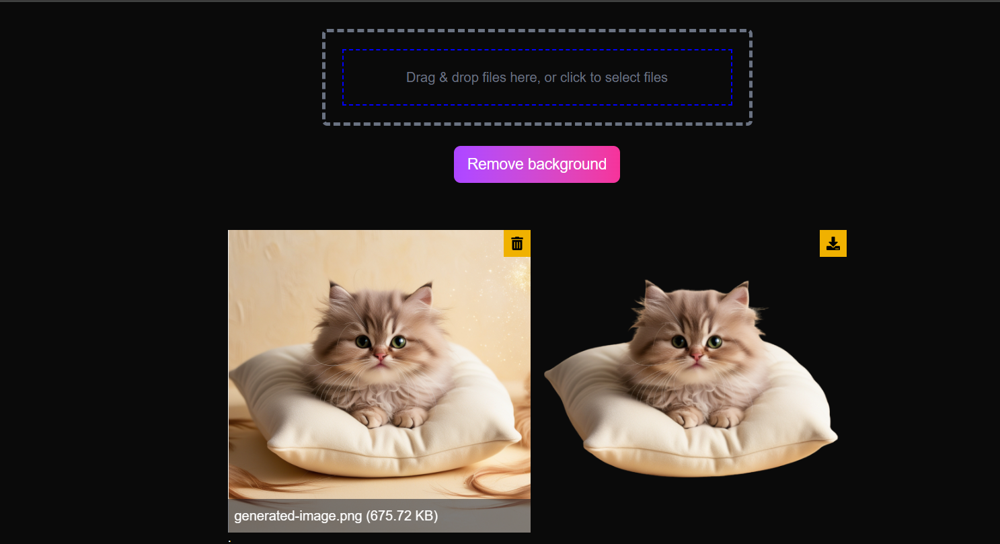

## REMOVE BACKGROUND

---
 - Preview 


```markdown
# 🧼 Background Remover (Next.js + Tailwind CSS)


A sleek and modern web app that removes image backgrounds using **AI models**. Users can upload a `.jpg` or `.png` file (max 5MB), and the background is removed using either:
- Here i am Using Two models one from repliacte Paid one , and remove bg a free one

- 🤖 [Replicate AI Model](https://replicate.com/lucataco/remove-bg)
- 🪄 [Remove.bg API](https://www.remove.bg/api)

---

## 🚀 Features

- Drag and drop image upload
- Real-time background removal using AI
- Toggle between **Replicate** and **Remove.bg**
- Base64 conversion for seamless API integration
- Responsive UI with Tailwind CSS
- Error handling and image validation
- Loader while processing image
- File size and type restrictions

---

## 🛠 Tech Stack

| Technology    | Description                            |
|---------------|----------------------------------------|
| Next.js       | React Framework for SSR & API routes   |
| Tailwind CSS  | Utility-first CSS for styling          |
| Replicate     | AI model to remove background          |
| Remove.bg     | Background removal API                 |
| React Dropzone| File upload drag & drop                |
| React Spinners| Loader component                       |

---

## 📦 Installation

```bash
git clone https://github.com/ShyamGuna77/Ai_Background_Remover.git
cd remove-bg-nextjs
npm install
```

---

## 🔐 Environment Variables

Create a `.env.local` file in the root directory and add your API keys:

```env
REPLICATE_TOKEN=your_replicate_api_token
REMOVE_BG_API_KEY=your_remove_bg_api_key
```

---

## 🧪 Running the App Locally

```bash
npm run dev
```

Visit: [http://localhost:3000](http://localhost:3000)

---

## 📁 Project Structure

```
.
├── app/
│   └── page.tsx                # UI logic & file upload
├── app/api/replicate/route.ts # Replicate model handler
├── app/api/removebg/route.ts  # Remove.bg API handler
├── 
├── public/                    # Static assets
├── styles/                    # Tailwind config
├── .env.local                 # API keys
└── README.md
```

---

## 🔄 How It Works

### 🧠 Replicate Model (lucataco/remove-bg)
- Accepts a base64-encoded image
- Returns a URL to the image with background removed
- Slower but flexible and AI-powered

### ✂️ Remove.bg API
- Accepts base64 or image URL
- Fast and accurate for human subjects
- Free tier available with limited credits

---

## 📤 Upload Flow

1. User drops an image using React Dropzone
2. Image is validated (PNG/JPEG, <5MB)
3. Converted to base64
4. Request sent to:
   - `/api/replicate` → Replicate Model
   - `/api/removebg` → Remove.bg API
5. Output image displayed in the UI

---

## 🖼 Sample Screenshot

> *(Include a screenshot here of before/after UI)*

---

## 🔄 Switching Between Models

Currently, the frontend uses `/api/replicate` by default. To use `remove.bg`:

```tsx
// in your frontend request:
await fetch("/api/removebg", { ... })
```

You can also add a toggle in the UI to switch between APIs dynamically.

---

## 🔐 API Reference

### /api/replicate

```json
POST /api/replicate
{
  "image": "data:image/png;base64,..."
}
```

### /api/removebg

```json
POST /api/removebg
{
  "image": "data:image/png;base64,..."
}
```

---

## ⚠️ Limitations

- Max file size: 5MB
- Replicate models can be slow without paid access
- Remove.bg has limited free credits

---

## 🧹 To-Do

- [ ] Add toggle between Replicate & Remove.bg
- [ ] Show before/after comparison slider
- [ ] Allow downloading processed image
- [ ] Support image paste from clipboard

---

## 🙌 Acknowledgements

- [Replicate](https://replicate.com/)
- [Remove.bg](https://www.remove.bg/)
- [React Dropzone](https://react-dropzone.js.org/)
- [React Spinners](https://www.davidhu.io/react-spinners/)
- [Tailwind CSS](https://tailwindcss.com/)

---

## 📄 License

MIT License. Feel free to fork and build upon!

---

## 🧑‍💻 Author

Made with 💖 by [ShyamGuna](https://github.com/ShyamGuna77)


